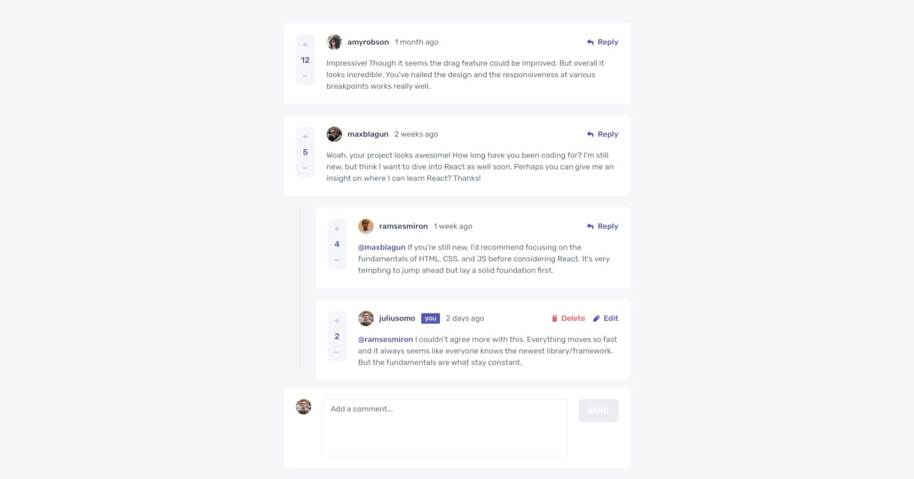
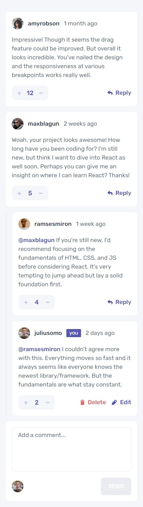

# Frontend Mentor - Interactive comments section solution

This is a solution to the [Interactive comments section challenge on Frontend Mentor](https://www.frontendmentor.io/challenges/interactive-comments-section-iG1RugEG9).

## Table of contents

- [Overview](#overview)
  - [The challenge](#the-challenge)
  - [Screenshot](#screenshot)
  - [Links](#links)
- [My process](#my-process)
  - [Built with](#built-with)
  - [What I learned](#what-i-learned)
- [Author](#author)

## Overview

### The challenge

Users should be able to:

- View the optimal layout for the app depending on their device's screen size
- See hover states for all interactive elements on the page
- Create, Read, Update, and Delete comments and replies
- Upvote and downvote comments
- **Bonus**: If you're building a purely front-end project, use `localStorage` to save the current state in the browser that persists when the browser is refreshed.
- **Bonus**: Instead of using the `createdAt` strings from the `data.json` file, try using timestamps and dynamically track the time since the comment or reply was posted.

### Screenshot





### Links

- Solution URL: [See solution here](https://www.frontendmentor.io/solutions/todo-app-localstorage-lightdark-mode-sveltekit-ts-and-tailwindcss-nL6zrqo54K)
- Live Site URL: [See live site here](https://interactive-comments-section-woad.vercel.app/)

## My process

### Built with

- Semantic HTML5 markup
- Flexbox
- LocalStorage - Save data as string on the browser
- [SvelteKit](https://kit.svelte.dev/) - JS framework
- [TailwindCss](https://tailwindcss.com/) - Utility-first CSS framework
- [Typescript](https://www.typescriptlang.org/) - Strongly typed JS
- [Date-fns](https://date-fns.org/) - Modern JavaScript date utility library.

### What I learned

#### svelte:self

This element allows a component to contain itself recursively. Nice is this project since the comments and their replies shares the exact same layout.

```js
// See below the Card components. I go throught the list of comments on the index page and each of them loops other its replies by calling itself //
<div>
  <div class="card grid-rows-[auto_1fr_auto] md:grid-rows-[auto_1fr] grid-cols-[auto_1fr_auto] gap-4 md:gap-x-6">
    <!-- Metadata -->
    <div class="col-span-3 md:col-start-2 md:col-span-1">
      <CardMetadata user={props.user} createdAt={props.createdAt} />
    </div>
    <!-- Content -->
    <div class="col-span-3 md:col-span-2">
      <CardContent id={props.id} content={props.content} {replyingTo} />
    </div>
    <!-- Vote -->
    <div class="col-span-1 md:row-span-2 md:row-start-1">
      <CardScore id={props.id} score={props.score} />
    </div>
    <!-- Reply -->
    <div class="col-span-1 col-start-3 md:row-start-1 place-self-center">
      <CardActions id={props.id} user={props.user} />
    </div>
  </div>
  <ReplyForm id={props.id} replyingTo={props.user.username} />
</div>
{#if replies.length !== 0}
  <div class="flex">
    <div class="shrink-0 w-[2px] rounded-xl bg-neutral-300 mr-4 md:mx-8 mt-4 md:mt-6 md:mb-4" />
    <div class="grow">
      {#each replies as { replyingTo, id, ...rest } (id)}
        <div animate:flip={{ duration: 150 }} transition:slide={{ duration: 150 }} class="mt-4 md:mt-6">
          <svelte:self props={{ id, ...rest }} {replyingTo} />
        </div>
      {/each}
    </div>
  </div>
{/if}
```

#### React-like hooks

You can use the svelte writable object to create custom hooks like in React.

In the store :

```js
import { writable } from "svelte/store";

export const useToggleState = (initial?: boolean) => {
  const state = writable<boolean>(initial ?? false);
  const toggle = (next?: boolean) => state.update((prev) => (next === undefined ? !prev : next));

  return [state, toggle] as const;
};
```

And in the Component:

```js
const [editing, toggleEditing] = useToggleState(false);
```

#### Moove the cursor to the last character inside an Element

Don't forget to make sure that the element is NOT UNDEFINED before using it tho.

```js
import { tick } from "svelte";

export const focusEditable = async (editable: HTMLElement) => {
  // ---- Move cursor to the last character on focus: START ---- //
  const selection = window.getSelection();
  const range = document.createRange();
  selection?.removeAllRanges();
  range.selectNodeContents(editable);
  range.collapse(false);
  selection?.addRange(range);
  await tick();
  editable.focus();
  // ---- Move cursor to the last character on focus: END ---- //
};
```

## Author

- Frontend Mentor - [@AntoineC-dev](https://www.frontendmentor.io/profile/AntoineC-dev)
